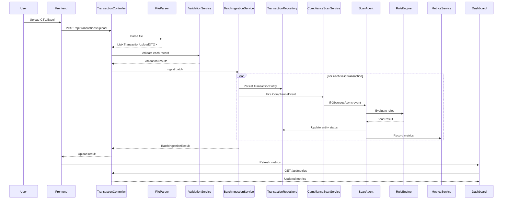

# Transaction Processing Workflow - Complete Implementation Plan

## Executive Summary

This document outlines the complete end-to-end implementation plan for the transaction processing workflow in ComplianceGuard, covering bulk upload, data normalization, processing, and dashboard metrics display.

## Architecture Overview

```mermaid
graph TB
    A[CSV/Excel Upload] --> B[File Parser Service]
    B --> C[Data Normalization Layer]
    C --> D[Batch Transaction Ingestion]
    D --> E[TransactionEntity Persistence]
    E --> F[CDI Event Bus]
    F --> G[ScanAgent @ObservesAsync]
    G --> H[Rule Engine Evaluation]
    H --> I[Alert Engine]
    H --> J[Audit Log]
    I --> K[Metrics Service]
    J --> K
    K --> L[Dashboard Metrics API]
    L --> M[Frontend Dashboard]
    
    style A fill:#4A5568
    style C fill:#2D3748
    style F fill:#3C3489
    style H fill:#3C3489
    style K fill:#0C447C
    style M fill:#085041
```



## Current State Analysis

### ✅ Already Implemented

1. **Individual Transaction Ingestion** ([`IngestorResource.java`](ComplianceGuardian/backend/src/main/java/com/guard/controller/IngestorResource.java))
   - REST endpoint: `POST /ingest/transaction`
   - Normalizes to [`ComplianceEvent`](ComplianceGuardian/backend/src/main/java/com/guard/model/ComplianceEvent.java)
   - Async event publishing via CDI

2. **Processing Pipeline** ([`ScanAgent.java`](ComplianceGuardian/backend/src/main/java/com/guard/agent/ScanAgent.java))
   - Observes async compliance events
   - Evaluates via [`ComplianceRuleEngine`](ComplianceGuardian/backend/src/main/java/com/guard/engine/ComplianceRuleEngine.java)
   - Processes alerts via [`AlertEngine`](ComplianceGuardian/backend/src/main/java/com/guard/engine/AlertEngine.java)
   - Records metrics via [`MetricsService`](ComplianceGuardian/backend/src/main/java/com/guard/metrics/MetricsService.java)

3. **Data Models**
   - [`TransactionEntity`](ComplianceGuardian/backend/src/main/java/com/guard/entity/TransactionEntity.java) - Database entity
   - [`Transaction`](ComplianceGuardian/backend/src/main/java/com/guard/model/Transaction.java) - Ingestion model
   - [`TransactionRepository`](ComplianceGuardian/backend/src/main/java/com/guard/repository/TransactionRepository.java) - Data access

4. **Dashboard** ([`Dashboard.tsx`](ComplianceGuardian/frontend/src/pages/Dashboard.tsx))
   - Metrics display
   - Upload button (UI only, no backend)

### ❌ Missing Components

1. **Bulk Upload Service** - CSV/Excel parsing not implemented
2. **Batch Processing** - No batch ingestion mechanism
3. **Data Normalization Layer** - No mapping from CSV to Transaction model
4. **Upload Progress Tracking** - No real-time feedback
5. **Validation Framework** - No data quality checks
6. **Batch Audit Trail** - No tracking of upload batches

---

## Implementation Plan

### Phase 1: Backend - File Upload & Parsing Service

#### 1.1 Create File Upload DTO

**File:** `ComplianceGuardian/backend/src/main/java/com/guard/dto/TransactionUploadDTO.java`

```java
package com.guard.dto;

import java.math.BigDecimal;
import java.time.Instant;

public class TransactionUploadDTO {
    public String transactionId;
    public String entityId;
    public String type;
    public BigDecimal amount;
    public String currency;
    public String fromAccount;
    public String toAccount;
    public String fromCountry;
    public String toCountry;
    public String customerId;
    public Instant timestamp;
    public String description;
    
    // Validation errors
    public transient String validationError;
    public transient int rowNumber;
}
```

#### 1.2 Create File Parser Service

**File:** `ComplianceGuardian/backend/src/main/java/com/guard/service/TransactionFileParser.java`

```java
package com.guard.service;

import com.guard.dto.TransactionUploadDTO;
import jakarta.enterprise.context.ApplicationScoped;
import org.apache.poi.ss.usermodel.*;
import org.apache.poi.xssf.usermodel.XSSFWorkbook;
import org.jboss.logging.Logger;

import java.io.InputStream;
import java.math.BigDecimal;
import java.time.Instant;
import java.util.ArrayList;
import java.util.List;

@ApplicationScoped
public class TransactionFileParser {
    
    private static final Logger LOG = Logger.getLogger(TransactionFileParser.class);
    
    public List<TransactionUploadDTO> parseCSV(InputStream inputStream) {
        // Parse CSV using Apache Commons CSV
        List<TransactionUploadDTO> transactions = new ArrayList<>();
        // Implementation details...
        return transactions;
    }
    
    public List<TransactionUploadDTO> parseExcel(InputStream inputStream) {
        List<TransactionUploadDTO> transactions = new ArrayList<>();
        try (Workbook workbook = new XSSFWorkbook(inputStream)) {
            Sheet sheet = workbook.getSheetAt(0);
            int rowNum = 0;
            
            for (Row row : sheet) {
                if (rowNum++ == 0) continue; // Skip header
                
                TransactionUploadDTO dto = new TransactionUploadDTO();
                dto.rowNumber = rowNum;
                
                try {
                    dto.transactionId = getCellValue(row, 0);
                    dto.entityId = getCellValue(row, 1);
                    dto.type = getCellValue(row, 2);
                    dto.amount = new BigDecimal(getCellValue(row, 3));
                    dto.currency = getCellValue(row, 4);
                    dto.fromAccount = getCellValue(row, 5);
                    dto.toAccount = getCellValue(row, 6);
                    dto.fromCountry = getCellValue(row, 7);
                    dto.toCountry = getCellValue(row, 8);
                    dto.customerId = getCellValue(row, 9);
                    dto.description = getCellValue(row, 10);
                    
                    transactions.add(dto);
                } catch (Exception e) {
                    dto.validationError = e.getMessage();
                    transactions.add(dto);
                }
            }
        } catch (Exception e) {
            LOG.errorf(e, "Failed to parse Excel file");
        }
        
        return transactions;
    }
    
    private String getCellValue(Row row, int cellIndex) {
        Cell cell = row.getCell(cellIndex);
        if (cell == null) return null;
        
        return switch (cell.getCellType()) {
            case STRING -> cell.getStringCellValue();
            case NUMERIC -> String.valueOf(cell.getNumericCellValue());
            case BOOLEAN -> String.valueOf(cell.getBooleanCellValue());
            default -> null;
        };
    }
}
```

**Dependencies to add to `pom.xml`:**
```xml
<dependency>
    <groupId>org.apache.poi</groupId>
    <artifactId>poi-ooxml</artifactId>
    <version>5.2.3</version>
</dependency>
<dependency>
    <groupId>org.apache.commons</groupId>
    <artifactId>commons-csv</artifactId>
    <version>1.10.0</version>
</dependency>
```

#### 1.3 Create Validation Service

**File:** `ComplianceGuardian/backend/src/main/java/com/guard/service/TransactionValidationService.java`

```java
package com.guard.service;

import com.guard.dto.TransactionUploadDTO;
import jakarta.enterprise.context.ApplicationScoped;

import java.math.BigDecimal;
import java.util.ArrayList;
import java.util.List;

@ApplicationScoped
public class TransactionValidationService {
    
    public List<String> validate(TransactionUploadDTO dto) {
        List<String> errors = new ArrayList<>();
        
        if (dto.transactionId == null || dto.transactionId.isBlank()) {
            errors.add("Transaction ID is required");
        }
        
        if (dto.entityId == null || dto.entityId.isBlank()) {
            errors.add("Entity ID is required");
        }
        
        if (dto.type == null || dto.type.isBlank()) {
            errors.add("Transaction type is required");
        }
        
        if (dto.amount == null || dto.amount.compareTo(BigDecimal.ZERO) <= 0) {
            errors.add("Amount must be greater than zero");
        }
        
        if (dto.currency == null || dto.currency.length() != 3) {
            errors.add("Currency must be a valid 3-letter code");
        }
        
        return errors;
    }
}
```

#### 1.4 Create Batch Ingestion Service

**File:** `ComplianceGuardian/backend/src/main/java/com/guard/service/BatchTransactionIngestionService.java`

```java
package com.guard.service;

import com.guard.dto.TransactionUploadDTO;
import com.guard.entity.TransactionEntity;
import com.guard.model.ComplianceEvent;
import com.guard.model.Transaction;
import com.guard.repository.TransactionRepository;
import jakarta.enterprise.context.ApplicationScoped;
import jakarta.inject.Inject;
import jakarta.transaction.Transactional;
import org.jboss.logging.Logger;

import java.time.Instant;
import java.util.ArrayList;
import java.util.List;
import java.util.UUID;

@ApplicationScoped
public class BatchTransactionIngestionService {
    
    private static final Logger LOG = Logger.getLogger(BatchTransactionIngestionService.class);
    
    @Inject
    TransactionRepository transactionRepository;
    
    @Inject
    TransactionValidationService validationService;
    
    @Inject
    ComplianceScanService scanService;
    
    @Transactional
    public BatchIngestionResult ingestBatch(List<TransactionUploadDTO> uploadedTransactions, String batchId) {
        BatchIngestionResult result = new BatchIngestionResult();
        result.batchId = batchId;
        result.totalRecords = uploadedTransactions.size();
        result.startTime = Instant.now();
        
        for (TransactionUploadDTO dto : uploadedTransactions) {
            try {
                // Validate
                List<String> errors = validationService.validate(dto);
                if (!errors.isEmpty()) {
                    result.failedRecords++;
                    result.errors.add(String.format("Row %d: %s", dto.rowNumber, String.join(", ", errors)));
                    continue;
                }
                
                // Normalize to TransactionEntity
                TransactionEntity entity = normalizeToEntity(dto, batchId);
                
                // Persist
                transactionRepository.persist(entity);
                
                // Fire compliance event for async processing
                Transaction transaction = normalizeToTransaction(dto);
                ComplianceEvent event = new ComplianceEvent(
                    ComplianceEvent.EventType.TRANSACTION,
                    dto.transactionId,
                    transaction
                );
                scanService.fireEvent(event);
                
                result.successfulRecords++;
                
            } catch (Exception e) {
                result.failedRecords++;
                result.errors.add(String.format("Row %d: %s", dto.rowNumber, e.getMessage()));
                LOG.errorf(e, "Failed to ingest transaction at row %d", dto.rowNumber);
            }
        }
        
        result.endTime = Instant.now();
        LOG.infof("Batch ingestion completed: batchId=%s, success=%d, failed=%d", 
                  batchId, result.successfulRecords, result.failedRecords);
        
        return result;
    }
    
    private TransactionEntity normalizeToEntity(TransactionUploadDTO dto, String batchId) {
        TransactionEntity entity = new TransactionEntity();
        entity.id = dto.transactionId != null ? dto.transactionId : UUID.randomUUID().toString();
        entity.entityId = dto.entityId;
        entity.type = dto.type;
        entity.amount = dto.amount;
        entity.currency = dto.currency;
        entity.fromAccount = dto.fromAccount;
        entity.toAccount = dto.toAccount;
        entity.fromCountry = dto.fromCountry;
        entity.toCountry = dto.toCountry;
        entity.status = "PENDING"; // Will be updated by rule engine
        entity.description = dto.description;
        entity.createdAt = Instant.now();
        entity.updatedAt = Instant.now();
        return entity;
    }
    
    private Transaction normalizeToTransaction(TransactionUploadDTO dto) {
        Transaction transaction = new Transaction();
        transaction.transactionId = dto.transactionId;
        transaction.amount = dto.amount;
        transaction.currency = dto.currency;
        transaction.originCountry = dto.fromCountry;
        transaction.destinationCountry = dto.toCountry;
        transaction.customerId = dto.customerId;
        transaction.timestamp = dto.timestamp != null ? dto.timestamp : Instant.now();
        return transaction;
    }
    
    public static class BatchIngestionResult {
        public String batchId;
        public int totalRecords;
        public int successfulRecords;
        public int failedRecords;
        public List<String> errors = new ArrayList<>();
        public Instant startTime;
        public Instant endTime;
    }
}
```

#### 1.5 Update TransactionController with Upload Endpoint

**File:** `ComplianceGuardian/backend/src/main/java/com/guard/controller/TransactionController.java`

Update the existing upload endpoint:

```java
@POST
@Path("/upload")
@Consumes(MediaType.MULTIPART_FORM_DATA)
@Transactional
public ApiResponse<BatchIngestionResult> uploadTransactions(
        @FormParam("file") InputStream fileInputStream,
        @FormParam("fileName") String fileName) {
    
    try {
        // Generate batch ID
        String batchId = UUID.randomUUID().toString();
        
        // Parse file based on extension
        List<TransactionUploadDTO> transactions;
        if (fileName.endsWith(".csv")) {
            transactions = fileParser.parseCSV(fileInputStream);
        } else if (fileName.endsWith(".xlsx") || fileName.endsWith(".xls")) {
            transactions = fileParser.parseExcel(fileInputStream);
        } else {
            return ApiResponse.error("Unsupported file format. Please upload CSV or Excel files.");
        }
        
        // Ingest batch
        BatchIngestionResult result = batchIngestionService.ingestBatch(transactions, batchId);
        
        return ApiResponse.success(result, 
            String.format("Processed %d records: %d successful, %d failed", 
                result.totalRecords, result.successfulRecords, result.failedRecords));
        
    } catch (Exception e) {
        LOG.errorf(e, "Failed to upload transactions");
        return ApiResponse.error("Upload failed: " + e.getMessage());
    }
}
```

---

### Phase 2: Backend - Enhanced Processing & Metrics

#### 2.1 Update ScanAgent to Update TransactionEntity

**File:** `ComplianceGuardian/backend/src/main/java/com/guard/agent/ScanAgent.java`

Add transaction entity update after rule evaluation:

```java
@Inject
TransactionRepository transactionRepository;

public void onComplianceEvent(@ObservesAsync ComplianceEvent event) {
    try {
        LOG.infof("Processing compliance event: eventId=%s, traceId=%s, type=%s",
                  event.eventId, event.traceId, event.eventType);

        // Step 1: Evaluate compliance rules
        ScanResult result = ruleEngine.evaluate(event);

        // Step 2: Update transaction entity with results
        if (event.eventType == ComplianceEvent.EventType.TRANSACTION) {
            updateTransactionEntity(event, result);
        }

        // Step 3: Process alerts based on risk level
        alertEngine.processResult(result);

        // Step 4: Create and save audit log
        AuditLog auditLog = new AuditLog(event.traceId, result);
        auditLogRepository.save(auditLog);

        // Step 5: Record metrics
        metricsService.recordScan(result);

        LOG.infof("Scan completed: traceId=%s, riskScore=%.2f, riskLevel=%s, violations=%d",
                  result.traceId, result.riskScore, result.riskLevel, result.violations.size());

    } catch (Exception e) {
        LOG.errorf(e, "Error processing compliance event: eventId=%s, traceId=%s",
                   event.eventId, event.traceId);
    }
}

@Transactional
private void updateTransactionEntity(ComplianceEvent event, ScanResult result) {
    if (!(event.payload instanceof Transaction tx)) {
        return;
    }
    
    TransactionEntity entity = transactionRepository.findById(tx.transactionId);
    if (entity != null) {
        entity.status = result.violations.isEmpty() ? "APPROVED" : "FLAGGED";
        entity.riskLevel = result.riskLevel;
        entity.riskScore = BigDecimal.valueOf(result.riskScore);
        entity.flaggedRules = result.violations.stream()
            .map(v -> v.type.toString())
            .collect(Collectors.joining(","));
        entity.updatedAt = Instant.now();
        
        transactionRepository.persist(entity);
    }
}
```

#### 2.2 Enhance MetricsController for Real-time Updates

**File:** `ComplianceGuardian/backend/src/main/java/com/guard/controller/MetricsController.java`

Add batch processing metrics:

```java
@GET
@Path("/batch/{batchId}")
public ApiResponse<BatchMetricsDTO> getBatchMetrics(@PathParam("batchId") String batchId) {
    BatchMetricsDTO metrics = new BatchMetricsDTO();
    
    // Query transactions by batch
    List<TransactionEntity> batchTransactions = transactionRepository
        .find("description like ?1", "%" + batchId + "%").list();
    
    metrics.batchId = batchId;
    metrics.totalTransactions = batchTransactions.size();
    metrics.pendingTransactions = batchTransactions.stream()
        .filter(t -> "PENDING".equals(t.status)).count();
    metrics.approvedTransactions = batchTransactions.stream()
        .filter(t -> "APPROVED".equals(t.status)).count();
    metrics.flaggedTransactions = batchTransactions.stream()
        .filter(t -> "FLAGGED".equals(t.status)).count();
    
    return ApiResponse.success(metrics);
}
```

---

### Phase 3: Frontend - Upload UI & Progress Tracking

#### 3.1 Create Upload Service

**File:** `ComplianceGuardian/frontend/src/services/uploadService.ts`

```typescript
import axios from 'axios';

export interface UploadProgress {
  loaded: number;
  total: number;
  percentage: number;
}

export interface BatchIngestionResult {
  batchId: string;
  totalRecords: number;
  successfulRecords: number;
  failedRecords: number;
  errors: string[];
  startTime: string;
  endTime: string;
}

class UploadService {
  async uploadTransactions(
    file: File,
    onProgress?: (progress: UploadProgress) => void
  ): Promise<BatchIngestionResult> {
    const formData = new FormData();
    formData.append('file', file);
    formData.append('fileName', file.name);

    const response = await axios.post<{ data: BatchIngestionResult }>(
      '/api/transactions/upload',
      formData,
      {
        headers: {
          'Content-Type': 'multipart/form-data',
        },
        onUploadProgress: (progressEvent) => {
          if (onProgress && progressEvent.total) {
            onProgress({
              loaded: progressEvent.loaded,
              total: progressEvent.total,
              percentage: Math.round((progressEvent.loaded * 100) / progressEvent.total),
            });
          }
        },
      }
    );

    return response.data.data;
  }

  async getBatchMetrics(batchId: string) {
    const response = await axios.get(`/api/metrics/batch/${batchId}`);
    return response.data.data;
  }
}

export default new UploadService();
```

#### 3.2 Create Upload Modal Component

**File:** `ComplianceGuardian/frontend/src/components/upload/TransactionUploadModal.tsx`

```typescript
import { useState } from 'react';
import { Upload, X, CheckCircle, AlertCircle, Loader } from 'lucide-react';
import Button from '@/components/ui/Button';
import Card from '@/components/ui/Card';
import uploadService, { BatchIngestionResult, UploadProgress } from '@/services/uploadService';

interface TransactionUploadModalProps {
  isOpen: boolean;
  onClose: () => void;
  onSuccess: () => void;
}

const TransactionUploadModal = ({ isOpen, onClose, onSuccess }: TransactionUploadModalProps) => {
  const [file, setFile] = useState<File | null>(null);
  const [uploading, setUploading] = useState(false);
  const [progress, setProgress] = useState<UploadProgress | null>(null);
  const [result, setResult] = useState<BatchIngestionResult | null>(null);
  const [error, setError] = useState<string | null>(null);

  const handleFileSelect = (event: React.ChangeEvent<HTMLInputElement>) => {
    const selectedFile = event.target.files?.[0];
    if (selectedFile) {
      setFile(selectedFile);
      setError(null);
      setResult(null);
    }
  };

  const handleUpload = async () => {
    if (!file) return;

    setUploading(true);
    setError(null);

    try {
      const uploadResult = await uploadService.uploadTransactions(file, setProgress);
      setResult(uploadResult);
      
      if (uploadResult.failedRecords === 0) {
        setTimeout(() => {
          onSuccess();
          handleClose();
        }, 2000);
      }
    } catch (err: any) {
      setError(err.response?.data?.message || 'Upload failed');
    } finally {
      setUploading(false);
    }
  };

  const handleClose = () => {
    setFile(null);
    setProgress(null);
    setResult(null);
    setError(null);
    onClose();
  };

  if (!isOpen) return null;

  return (
    <div className="fixed inset-0 bg-black/50 flex items-center justify-center z-50">
      <Card className="w-full max-w-2xl mx-4">
        <div className="flex items-center justify-between mb-6">
          <h2 className="text-2xl font-bold text-white">Upload Transactions</h2>
          <button onClick={handleClose} className="text-dark-400 hover:text-white">
            <X className="w-6 h-6" />
          </button>
        </div>

        {/* File Selection */}
        {!result && (
          <div className="space-y-4">
            <div className="border-2 border-dashed border-dark-600 rounded-lg p-8 text-center">
              <Upload className="w-12 h-12 text-dark-500 mx-auto mb-4" />
              <p className="text-dark-300 mb-2">
                {file ? file.name : 'Choose a CSV or Excel file'}
              </p>
              <input
                type="file"
                accept=".csv,.xlsx,.xls"
                onChange={handleFileSelect}
                className="hidden"
                id="file-input"
              />
              <label htmlFor="file-input">
                <Button variant="secondary" size="sm" as="span">
                  Select File
                </Button>
              </label>
            </div>

            {/* Upload Progress */}
            {uploading && progress && (
              <div className="space-y-2">
                <div className="flex items-center justify-between text-sm">
                  <span className="text-dark-400">Uploading...</span>
                  <span className="text-white">{progress.percentage}%</span>
                </div>
                <div className="w-full bg-dark-700 rounded-full h-2">
                  <div
                    className="bg-primary-500 h-2 rounded-full transition-all"
                    style={{ width: `${progress.percentage}%` }}
                  />
                </div>
              </div>
            )}

            {/* Error Message */}
            {error && (
              <div className="flex items-center space-x-2 text-red-400 bg-red-900/20 p-3 rounded">
                <AlertCircle className="w-5 h-5" />
                <span>{error}</span>
              </div>
            )}

            {/* Actions */}
            <div className="flex justify-end space-x-3">
              <Button variant="ghost" onClick={handleClose} disabled={uploading}>
                Cancel
              </Button>
              <Button
                onClick={handleUpload}
                disabled={!file || uploading}
                className="flex items-center"
              >
                {uploading ? (
                  <>
                    <Loader className="w-4 h-4 mr-2 animate-spin" />
                    Processing...
                  </>
                ) : (
                  <>
                    <Upload className="w-4 h-4 mr-2" />
                    Upload
                  </>
                )}
              </Button>
            </div>
          </div>
        )}

        {/* Upload Result */}
        {result && (
          <div className="space-y-4">
            <div className="flex items-center space-x-3">
              {result.failedRecords === 0 ? (
                <CheckCircle className="w-8 h-8 text-green-500" />
              ) : (
                <AlertCircle className="w-8 h-8 text-yellow-500" />
              )}
              <div>
                <h3 className="text-lg font-semibold text-white">
                  Upload {result.failedRecords === 0 ? 'Successful' : 'Completed with Errors'}
                </h3>
                <p className="text-dark-400 text-sm">Batch ID: {result.batchId}</p>
              </div>
            </div>

            <div className="grid grid-cols-3 gap-4">
              <div className="bg-dark-700 p-4 rounded-lg">
                <p className="text-dark-400 text-sm mb-1">Total Records</p>
                <p className="text-2xl font-bold text-white">{result.totalRecords}</p>
              </div>
              <div className="bg-green-900/20 p-4 rounded-lg">
                <p className="text-green-400 text-sm mb-1">Successful</p>
                <p className="text-2xl font-bold text-green-400">{result.successfulRecords}</p>
              </div>
              <div className="bg-red-900/20 p-4 rounded-lg">
                <p className="text-red-400 text-sm mb-1">Failed</p>
                <p className="text-2xl font-bold text-red-400">{result.failedRecords}</p>
              </div>
            </div>

            {result.errors.length > 0 && (
              <div className="bg-dark-700 p-4 rounded-lg max-h-48 overflow-y-auto">
                <h4 className="text-sm font-semibold text-white mb-2">Errors:</h4>
                <ul className="space-y-1 text-sm text-red-400">
                  {result.errors.map((error, index) => (
                    <li key={index}>• {error}</li>
                  ))}
                </ul>
              </div>
            )}

            <div className="flex justify-end">
              <Button onClick={handleClose}>Close</Button>
            </div>
          </div>
        )}
      </Card>
    </div>
  );
};

export default TransactionUploadModal;
```

#### 3.3 Update Dashboard to Use Upload Modal

**File:** `ComplianceGuardian/frontend/src/pages/Dashboard.tsx`

Replace the file input with modal:

```typescript
import { useState } from 'react';
import TransactionUploadModal from '@/components/upload/TransactionUploadModal';

const Dashboard = () => {
  const [uploadModalOpen, setUploadModalOpen] = useState(false);
  
  // ... existing code ...

  const handleUploadSuccess = () => {
    // Refetch metrics
    queryClient.invalidateQueries(['metrics']);
    queryClient.invalidateQueries(['alerts']);
    queryClient.invalidateQueries(['activity']);
  };

  return (
    <div className="space-y-6">
      {/* Header */}
      <div className="flex items-center justify-between">
        <div>
          <h1 className="text-3xl font-bold text-white mb-2">Dashboard</h1>
          <p className="text-dark-400">
            Monitor compliance health and system activity
          </p>
        </div>
        
        <Button onClick={() => setUploadModalOpen(true)}>
          <Upload className="w-4 h-4 mr-2" />
          Upload Transactions
        </Button>
      </div>

      {/* ... rest of dashboard ... */}

      <TransactionUploadModal
        isOpen={uploadModalOpen}
        onClose={() => setUploadModalOpen(false)}
        onSuccess={handleUploadSuccess}
      />
    </div>
  );
};
```

---

## Data Flow Diagram



---

## CSV File Format Specification

### Required Columns

| Column | Type | Description | Example |
|--------|------|-------------|---------|
| transaction_id | String | Unique identifier | TXN-001234 |
| entity_id | String | Entity/customer ID | ACME-CORP |
| type | String | Transaction type | WIRE_TRANSFER |
| amount | Decimal | Transaction amount | 95000.00 |
| currency | String | 3-letter currency code | USD |
| from_account | String | Source account | ACC-12345 |
| to_account | String | Destination account | ACC-67890 |
| from_country | String | 2-letter country code | US |
| to_country | String | 2-letter country code | CH |
| customer_id | String | Customer identifier | CUST-5678 |
| description | String | Transaction description | Wire transfer payment |

### Sample CSV

```csv
transaction_id,entity_id,type,amount,currency,from_account,to_account,from_country,to_country,customer_id,description
TXN-001,ACME-CORP,WIRE_TRANSFER,95000.00,USD,ACC-12345,ACC-67890,US,CH,CUST-5678,International wire transfer
TXN-002,BETA-INC,ACH,5000.00,USD,ACC-11111,ACC-22222,US,US,CUST-1234,Domestic ACH payment
TXN-003,GAMMA-LLC,CARD,250.00,EUR,CARD-9999,MERCH-8888,DE,FR,CUST-9999,Card payment
```

---

## Testing Strategy

### Unit Tests

1. **FileParser Tests**
   - Valid CSV parsing
   - Valid Excel parsing
   - Invalid file format handling
   - Empty file handling

2. **Validation Tests**
   - Required field validation
   - Data type validation
   - Business rule validation

3. **Batch Ingestion Tests**
   - Successful batch processing
   - Partial failure handling
   - Transaction rollback on error

### Integration Tests

1. **End-to-End Upload Flow**
   - Upload → Parse → Validate → Persist → Process
   - Verify TransactionEntity creation
   - Verify ComplianceEvent firing
   - Verify metrics update

2. **Dashboard Metrics**
   - Verify real-time metric updates
   - Verify batch metrics calculation

---

## Performance Considerations

### Batch Size Limits

- **Maximum file size:** 10 MB
- **Maximum records per batch:** 10,000
- **Processing timeout:** 5 minutes

### Optimization Strategies

1. **Batch Persistence**
   - Use `transactionRepository.persist()` in batches of 100
   - Commit every 1000 records

2. **Async Processing**
   - File parsing runs synchronously
   - Rule evaluation runs asynchronously via CDI events
   - Metrics aggregation runs asynchronously

3. **Progress Tracking**
   - Frontend polls `/api/metrics/batch/{batchId}` every 2 seconds
   - Backend caches batch status for 1 hour

---

## Error Handling

### File Upload Errors

| Error | HTTP Status | Message |
|-------|-------------|---------|
| Invalid file format | 400 | Unsupported file format |
| File too large | 413 | File exceeds 10 MB limit |
| Parse error | 400 | Failed to parse file |

### Validation Errors

- Collected per row
- Returned in `BatchIngestionResult.errors`
- Failed rows are skipped, successful rows are processed

### Processing Errors

- Logged with traceId
- Recorded in audit log
- Metrics updated to reflect failures

---

## Monitoring & Observability

### Metrics to Track

1. **Upload Metrics**
   - `compliance.uploads.total` - Total uploads
   - `compliance.uploads.records` - Records per upload
   - `compliance.uploads.duration` - Upload processing time

2. **Validation Metrics**
   - `compliance.validation.failures` - Validation failures
   - `compliance.validation.success_rate` - Success rate

3. **Processing Metrics**
   - Already tracked by [`MetricsService`](ComplianceGuardian/backend/src/main/java/com/guard/metrics/MetricsService.java)
   - `compliance.scans.total`
   - `compliance.violations.total`

### Instana Traces

- Upload endpoint traced automatically
- Batch processing spans tracked
- Rule evaluation spans tracked
- End-to-end trace from upload to dashboard

---

## Security Considerations

1. **File Upload Security**
   - Validate file extensions
   - Scan for malicious content
   - Limit file size
   - Sanitize file names

2. **Data Validation**
   - Prevent SQL injection via parameterized queries
   - Validate all input fields
   - Sanitize user input

3. **Access Control**
   - Require authentication for upload endpoint
   - Audit all upload operations
   - Track user who initiated upload

---

## Deployment Checklist

### Backend

- [ ] Add Apache POI dependencies to `pom.xml`
- [ ] Create file parser service
- [ ] Create validation service
- [ ] Create batch ingestion service
- [ ] Update TransactionController
- [ ] Update ScanAgent
- [ ] Add batch metrics endpoint
- [ ] Run database migrations
- [ ] Deploy to OpenShift

### Frontend

- [ ] Create upload service
- [ ] Create upload modal component
- [ ] Update Dashboard component
- [ ] Add progress tracking
- [ ] Test file upload flow
- [ ] Deploy to production

### Testing

- [ ] Unit tests for all services
- [ ] Integration tests for upload flow
- [ ] Load testing with 10,000 records
- [ ] UI/UX testing

### Documentation

- [ ] API documentation
- [ ] CSV format specification
- [ ] User guide for upload feature
- [ ] Troubleshooting guide

---

## Success Criteria

1. ✅ Users can upload CSV/Excel files with transactions
2. ✅ System validates and normalizes uploaded data
3. ✅ Transactions are persisted to database
4. ✅ Rule engine evaluates uploaded transactions
5. ✅ Dashboard displays real-time metrics
6. ✅ Upload progress is tracked and displayed
7. ✅ Errors are handled gracefully
8. ✅ Audit trail is maintained for all uploads

---

## Next Steps

After reviewing this plan, we can proceed with implementation in the following order:

1. **Backend Phase 1** - File parsing and validation (2-3 days)
2. **Backend Phase 2** - Batch ingestion and processing (2-3 days)
3. **Frontend Phase 3** - Upload UI and progress tracking (2-3 days)
4. **Testing & Integration** - End-to-end testing (2 days)
5. **Deployment** - Production deployment (1 day)

**Total Estimated Time:** 9-13 days

Would you like me to proceed with implementing any specific phase, or would you like to discuss any modifications to this plan?